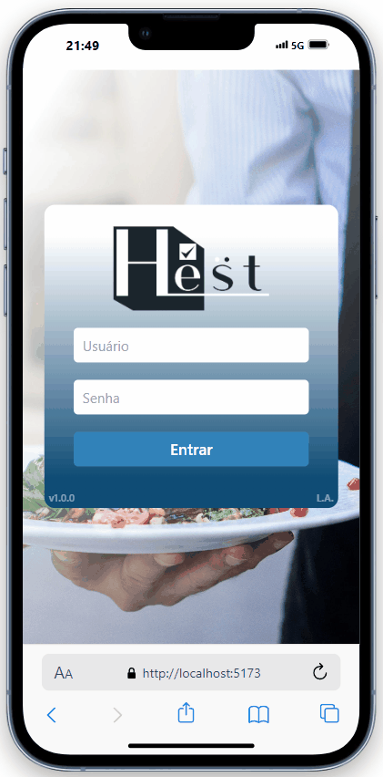

<h2>Projeto de aplicativo para restaurante em desenvolvimento...</h2>
 

A arquitetura deste projeto conta com 3 casos de uso, um sistema para atendente, um monitor que irá ficar na cozinha listando pedidos e produtos, onde o chefe de cozinha ou responsável poderá realizar a baixa do pedido para ser entregue, 
  e o terceiro caso de uso, este abaixo, um aplicativo onde os garçons poderão ao se logar anotar, editar ou cancelar pedidos, dar baixa no pagamento e finalizar o pedido, assim liberando uma mesa para ser vinculada a pedidos futuros.

